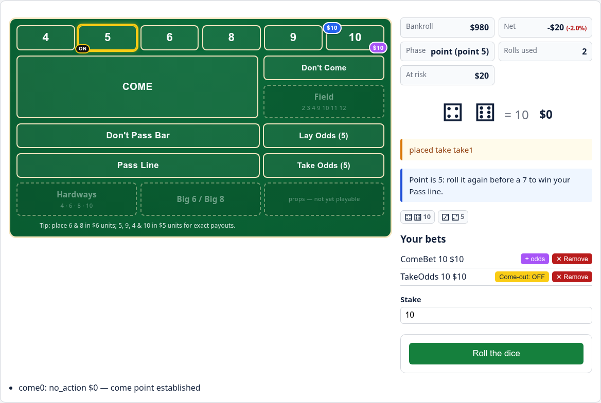
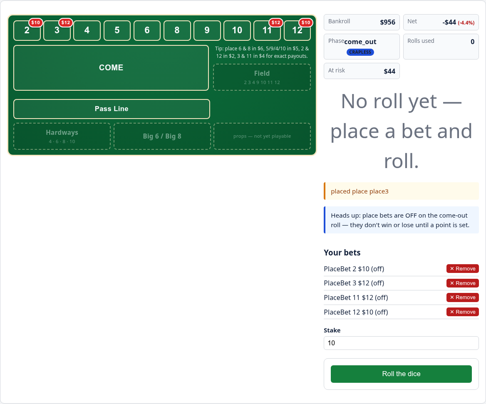
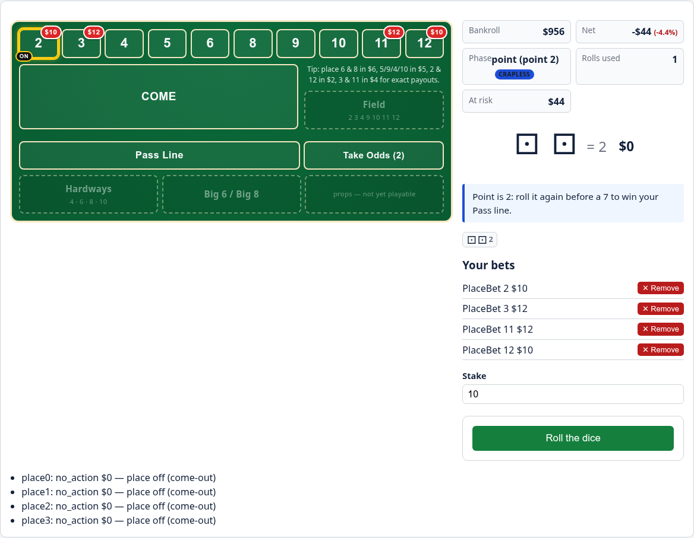

<div align="center">


<h1 align="center">🎲 marcy-dice-engine 🎲</h1>

> An exact-math **craps betting-strategy analyzer & practice simulator** — a pure, I/O-free engine with an interactive Textual TUI and a FastAPI + HTMX play-mode web app.


</div>

**marcy-dice-engine** computes the *exact* odds, payouts, and house edge of craps
bets — including combined "hedged" strategies — and then lets you **play them
out**: run deterministic sessions, race strategies through Monte Carlo for Risk of
Ruin, or sit down at a browser green-felt table and bet a bankroll by hand.

All money and odds use `fractions.Fraction` for **exact** arithmetic — floats
appear only at the display edge. The engine is pure and I/O-free; thin
`examples/`, `craps_tui`, and `craps_api` layers do all the printing and I/O.

## Three ways to use it

| Surface | Command | What it's for |
|---|---|---|
| 🟢 **Web play table** | `uv run craps-web` | Bet a bankroll on a clickable green felt, roll, and watch a live wallet with coaching hints |
| 📊 **Analyzer TUI** | `uv run craps-tui` | Get the net-payout matrix + dual-lens EV of any bet mix from a terminal |
| 🐍 **Python library** | `import craps_engine` | Sessions, Monte Carlo, and exact-math analysis with structured (JSON-ready) return types |

## Quickstart

```bash
uv sync --all-groups          # install everything into a local venv
uv run craps-web              # ① browser play table  → http://localhost:8000/
uv run craps-tui              # ② terminal odds/EV calculator
uv run python examples/hedged_dp_place68.py     # ③ a worked analysis
uv run python examples/simulate_strategies.py   #    a Monte Carlo strategy race
```

No manual venv activation and no `pip` — every command runs through `uv`.

---

## 🟢 Web app — play mode

A deployable **FastAPI + HTMX** table where you actually *play* a session: place
bets on clickable felt zones (or a free-text box), roll the dice, and watch a live
bankroll with data-driven coaching hints. It drives the same pure engine through a
`PlayController` and an in-memory session store. Web dependencies (FastAPI /
uvicorn / Jinja2) live only in the `web` dependency group and only inside
`src/craps_api/`, so the published engine stays stdlib-only.

```bash
uv run craps-web        # serves on http://localhost:8000/
```

Open <http://localhost:8000/>, start a game from the form (seed / starting stake /
optional **Crapless** variant), then click the felt and roll. Games are
**uncapped** — a game ends only on a bust or a win-goal, never a roll count.


### What the felt gives you

- **Wallet / cash bankroll** — the bankroll shown is your free cash: placing a bet
  moves its stake onto the felt and **lowers** it, removing a bet returns the cash
  and **raises** it, and a win credits the profit. At any moment
  `bankroll + at-risk` = your net worth. (Bust is judged on net worth, so chips on
  the felt never end the game. The analyzer and Monte Carlo keep net-worth
  accounting; only this view is wallet-based.)
- **Advisory bet units** — payouts only land in whole dollars on the right stake
  multiple, so clicking a zone snaps the shared stake for you: Place **6/8** → $6s,
  **5/9/4/10** → $5s; take odds **6/8** → $5s, **5/9** → $2s, **4/10** → $1s (lay
  is the inverse). Each zone's tooltip advises the unit. (The JSON API still
  accepts any exact amount.)
- **Free odds behind the line** — once a point is on, Take/Lay slots appear behind
  the flat bets to back them at **zero house edge**, requiring a matching flat bet
  and capped at the standard **3-4-5×** table max (naked or over-max odds are
  refused).
- **Free odds on Come / Don't Come** — when a Come bet travels to its come-point, a
  **+ odds** control backs it (pooled under the same 3-4-5× cap) with the odds chip
  on that box. True to a real table those come-odds ride **OFF on the come-out** by
  default, with a per-bet **Come-out: ON/OFF** toggle to call them on.
- **Crapless Craps variant** — tick **Crapless craps** on the new-game form for
  "Never Ever Craps": only a **7** wins the come-out and **every other total
  becomes a point**, so 2/3/11/12 join the box row as placeable / oddsable points
  (Place 2/12 pay 11:2, 3/11 pay 11:4; free odds 2/12 → 6:1, 3/11 → 3:1). Faithful
  to real crapless tables the **Don't side is not offered** — the felt hides those
  zones and shows a **Crapless** badge. Play-mode only; the analyzer and Monte
  Carlo stay standard.
- **Trackers & polish** — a point-ON puck (yellow ring + "ON"), a Net % beside the
  Net dollars, a total-at-risk badge, a last-10 roll strip, a per-roll net
  indicator, press/remove controls per bet, odds-ratio tooltips, and a wide-screen
  no-scroll dashboard (the narrow / mobile layout is preserved).

### A hand, step by step

> **Reading the Net:** the board uses a **wallet/cash** model, so placing a bet
> moves that cash from your bankroll onto the felt. Before anything resolves, Net
> reads as the *negative of the "At risk" amount* — the stakes are **committed, not
> lost**. A removal (or a win) returns that cash and Net moves back up.


*Bets placed: Pass Line `$10` + Place 6 `$12` + Place 8 `$12` = `$34` moved onto the
felt, so Bankroll drops to `$966` and Net reads `-$34` — exactly the `$34` now
At-risk. Committed stake, not a loss.*


*After a roll: a come-out 5 **establishes the point** (no bet wins or loses), so the
per-roll net is `$0` and Net holds at `-$34`, waiting on the point.*


*Point ON: the yellow ring + "ON" puck on the point's box, with the Take/Lay
free-odds zones now available.*


*Come odds: a Come bet has travelled to box 10 (blue chip) and is backed with free
odds (purple chip on the same box). Its row shows a **+ odds** control and a
**Come-out: OFF** toggle. Net `-$20` is just the `$20` committed (`$10` come + `$10`
odds), not a loss.*

### Crapless Craps

Tick **Crapless craps** on the new-game form to play "Never Ever Craps": only a
**7** wins the come-out and **every other total becomes a point**, so 2, 3, 11 and
12 join the box row as placeable / oddsable points (there is no craps loss and 11
is no longer a come-out win). Faithful to real crapless tables, the **Don't side is
not offered**. It's a play-mode variant only — the analyzer and Monte Carlo stay
standard. The exact math: Place **2/12** pay `11:2`, Place **3/11** pay `11:4`;
free odds **2/12 → 6:1**, **3/11 → 3:1**.


*Crapless felt: the box row now carries **2, 3, 11 and 12** (chipped here with Place
bets), the phase shows a **Crapless** badge, and the Don't Pass / Don't Come / Lay
zones are gone.*


*A come-out **2** establishes **point 2** — impossible in standard craps — with the
yellow ring + "ON" puck on box 2 and a Take Odds slot (2/12 pay 6:1) now open
behind the line.*

<details>
<summary><b>JSON API</b> — the same app exposes a small JSON API under <code>/api</code></summary>

Usable by programmatic clients (a legal-but-refused bet returns HTTP 200 with
`ok=false`; an unknown session is 404):

| Method & path | Purpose |
|---|---|
| `POST /api/game` | Create a game (`{seed, starting_bankroll, max_rolls, win_goal, loss_limit, crapless}`) → `{session_id, view}` (201) |
| `GET  /api/game/{id}` | The current `GameView` |
| `POST /api/game/{id}/bet` | Place a structured (`{kind, amount[, number]}`) or free-text (`{text}`) bet |
| `POST /api/game/{id}/roll` | Roll once → `RollOutcome` |
| `POST /api/game/{id}/bet/{bet_id}/remove` | Take a bet down |
| `POST /api/game/{id}/bet/{bet_id}/press` | Press a just-won bet by its winnings |
| `POST /api/game/{id}/bet/{bet_id}/odds-working` | Call a come-odds bet ON/OFF for the come-out |

</details>

<details>
<summary><b>Deploy with Docker</b></summary>

The repo ships a `Dockerfile` that runs the web app straight from the synced
source tree (`uv sync --group web`, then `uv run craps-web`):

```bash
docker build -t craps-web .
docker run -p 8000:8000 craps-web   # then open http://localhost:8000/
```

Portable to any container host (e.g. Cloud Run). It runs from source rather than a
built wheel on purpose: the wheel packages only `craps_engine`, not `craps_api` or
its `templates/`/`static/` data files, so `uv sync` (an editable-style install of
all of `src/`) is what makes the web app available at runtime.

</details>

<details>
<summary><b>Regenerating the screenshots</b></summary>

The screenshots above are produced by `docs/capture_screenshots.py`, a
PEP 723 standalone script that boots the app on a fixed port and drives the HTMX
flows headless with Chromium at a fixed seed for reproducibility. Playwright is a
**script-only inline dependency** of that file — deliberately **not** a project
dependency, so the quality gate and tests never import it.

```bash
uv run --with playwright playwright install chromium   # one-time
uv run --script docs/capture_screenshots.py            # writes docs/images/*.png
```

</details>

---

## 📊 Analyzer TUI

<details>
<summary>Textual calculator for static odds/EV analysis (<code>uv run craps-tui</code>)</summary>

```bash
uv run craps-tui
```

Type a comma- or newline-separated set of bets and a point, then press **Analyze**
(`a`) for the net-payout matrix and both EV lenses. For example:

```
dontpass:10, place 6:6, place 8:6      point = 4
```

Press **Verify** (`v`) to run the golden math self-check (see
[Verify the math](#verify-the-math)). `textual` lives in its own `ui` dependency
group so it never becomes a runtime dependency of the engine
(`[project.dependencies]` stays empty); `[tool.uv] default-groups` syncs it into
the dev venv, so `uv run craps-tui` just works.

</details>

---

## 🐍 Using the engine as a library

The engine is a pure, fully type-hinted OO core that returns structured,
JSON-ready data (no `print`). The pieces:

- **Dice** — `RandomDice(seed)` (reproducible) and `ScriptedDice` for deterministic
  scenarios, behind a `Dice` protocol.
- **GameState + Ruleset** — a come-out / point state machine that also admits
  Come / Don't Come sub-points. A frozen `Ruleset` (`STANDARD` / `CRAPLESS`) rides
  on the state and drives the come-out rules.
- **Bet registry** — exact odds, payouts, and house edges (Pass `7/495`,
  Don't Pass `3/220`, Place `1/66` · `1/25` · `1/15`, free odds `0`, plus the
  crapless place edges `1/14` · `1/16`), per-roll edges, and the 36-combo
  total-probability table.
- **Bets** — Pass Line, Don't Pass (bar 12), Take/Lay free odds, Place bets
  (4–10, plus 2/3/11/12 under crapless), and traveling **Come / Don't Come** built
  on `Bet` lifecycle hooks (`remains_on_table`, `advance`).
- **PortfolioAnalyzer** — for a combined set of wagers, a **net-payout matrix**
  (net bankroll change per total 2–12) and **dual-lens EV**: *Lens A* single-roll
  EV (the variance / hedge view) and *Lens B* house drag = Σ(amount × house-edge)
  (the honest long-run cost).
- **Strategies** — a `Strategy` protocol plus starters (`PassLineStrategy`,
  `PassLineOddsStrategy`, `DontPassPlaceStrategy`).
- **Session runner** — `Table` + `run_session`: a deterministic single-session
  loop producing a bankroll trajectory (`SessionConfig` → `SessionResult`).
- **Monte Carlo** — `run_monte_carlo` → `MonteCarloResult`: Risk of Ruin, goal-hit
  rate, mean / median / stdev ending bankroll, percentiles, mean roll count.

The `examples/hedged_dp_place68.py` demo builds a hedge (Don't Pass 10 + Place 6 /
Place 8, point = 4) and prints the net-payout matrix and both EV lenses. The
teaching moment: the don't-bettor looks *favored this roll* (Lens A) yet has
already conceded a fixed long-run cost (Lens B).

```
matrix:  4: -10   6: +7   7: -2   8: +7
Lens A (single-roll EV) = 7/9
Lens B (house drag)     = 7/22
```

---

## Verify the math

Golden-verify recomputes a small set of canonical scenarios (the Don't Pass +
Place 6/8 hedge, a lone Pass Line, and a lone Place 6) through the real engine and
asserts each result equals an independently hand-derived exact `Fraction` oracle.
It runs both as `tests/test_golden.py` and behind the TUI's Verify action, so any
drift in the engine's arithmetic is caught immediately. The canonical oracle
values live in [CODE_STANDARDS.md](./CODE_STANDARDS.md#exact-craps-math-reference-table).

## Project layout

```
src/craps_engine/   pure, stdlib-only engine (no I/O)
  money.py       Fraction odds + serialization
  dice.py        random + deterministic dice
  registry.py    odds/payout/house-edge table
  state.py       GameState machine
  ruleset.py     frozen Ruleset (STANDARD / CRAPLESS) carried on GameState + SessionConfig
  portfolio.py   PortfolioAnalyzer (dual-lens EV)
  strategy.py    Strategy protocol + starter strategies
  session.py     Table + run_session single-session runner
  montecarlo.py  run_monte_carlo: Risk of Ruin + ending-bankroll stats
  bets/          Bet ABC (lifecycle hooks) + concrete bet types
    come.py        ComeBet + DontCome (traveling come-point bets)
src/craps_tui/      Textual UI + golden-verify (the only place textual/I/O live)
  golden.py      run_golden_checks math self-check
  viewmodel.py   pure parse/format seam over the engine
  app.py         Textual App (Analyze + Verify actions)
  __main__.py    console entry point (craps-tui)
src/craps_api/      FastAPI JSON API + HTMX green-felt play-mode web app
  app.py            FastAPI factory: JSON /api routes + HTMX HTML routes
  session_store.py  in-memory session store over PlayController
  board.py          pure board-context builder for the HTML partial
  runner.py         console entry point (craps-web) — uvicorn boot glue
  templates/        Jinja2 templates (index.html + _board.html partial)
  static/           static assets (style.css)
examples/        runnable demos (the only place that prints/formats)
tests/           pytest suite
docs/notes/      session notes
```

## Development

Tooling: `uv` (packaging), `ruff` (lint + format), `ty` (type-check),
`pytest` + `pytest-cov` (test). Run the full quality gate before every commit:

```bash
uv run ruff format --check && uv run ruff check && uv run ty check src/ && uv run pytest
```

Currently: ruff + ty clean, **567 tests passing, 99.73% coverage** (across
`craps_engine` + `craps_tui` + `craps_api`). See
[CODE_STANDARDS.md](./CODE_STANDARDS.md) for conventions and
[PLANS.md](./PLANS.md) for task history.

### Roadmap

- Affordability constraints on the play-mode wallet (block a bet larger than the
  cash in hand — the placement deduction already lands in the wallet view).
- Bankroll-trajectory charts on the existing serialization-ready return types.
- A strategy DSL for declaring betting policies.
