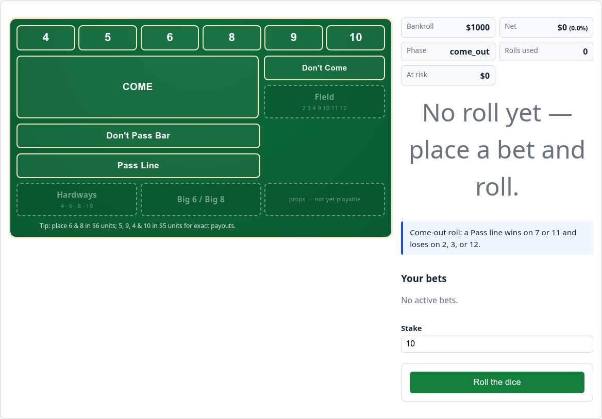
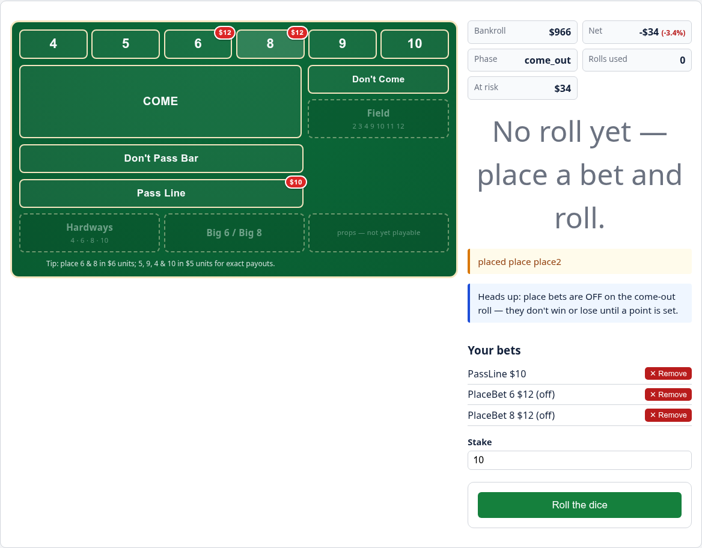
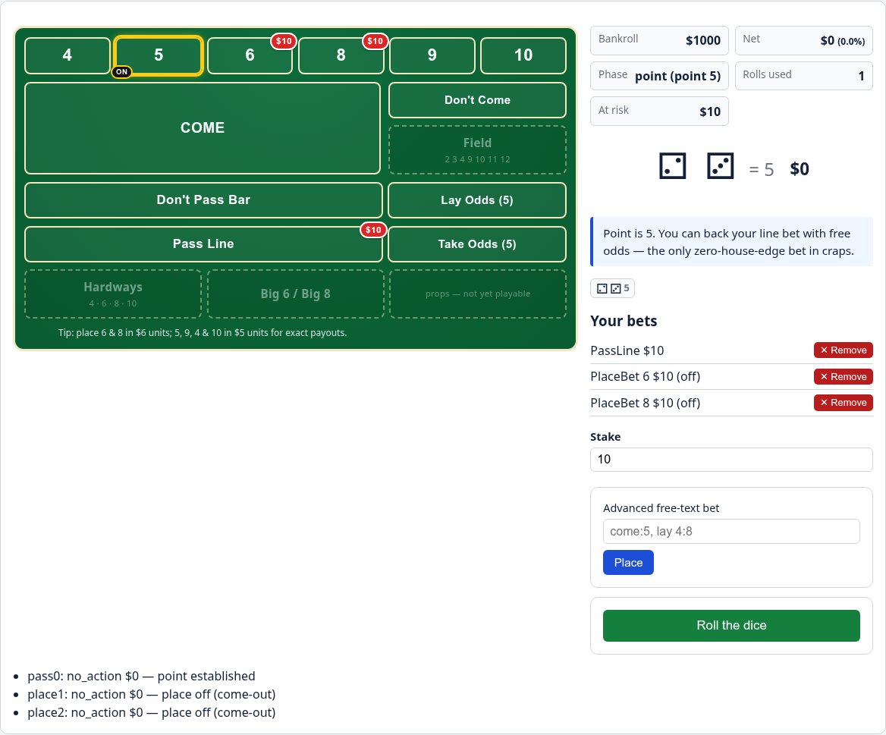
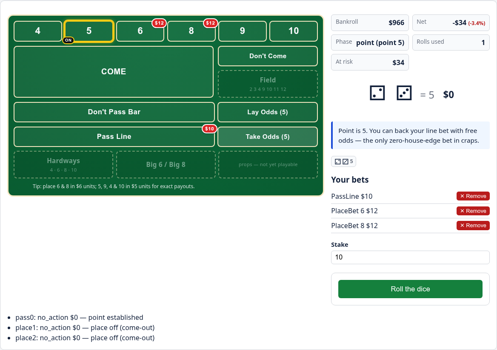

<div align="center">


<h1 align="center">🎲 marcy-dice-engine 🎲</h1>

> An exact-math **craps betting-strategy analyzer & practice simulator** — a pure, I/O-free engine with an interactive Textual TUI and a FastAPI + HTMX play-mode web app.


</div>

Built to learn the exact odds, payouts, and house-edge mechanics of combined
(hedged) craps strategies, then *play them out*: run deterministic sessions, race
strategies through Monte Carlo for Risk of Ruin and bankroll distributions, and
explore it all from a terminal UI or a browser green-felt table.

The engine is a pure, I/O-free, fully type-hinted OO core. Money and odds use
`fractions.Fraction` internally for **exact** arithmetic; floats appear only at a
single serialization boundary (and in the Monte Carlo aggregation layer). The
engine returns structured data (no `print`) — thin `examples/`, `craps_tui`, and
`craps_api` layers do all the formatting and I/O.

## Features

### Engine core (pure stdlib)

- **Dice** — `RandomDice(seed)` (reproducible) and `ScriptedDice` for deterministic
  scenarios, behind a `Dice` protocol.
- **GameState** — a come-out / point state machine that also admits Come / Don't
  Come sub-points.
- **Bet registry** — exact odds, payouts, and house edges (Pass `7/495`,
  Don't Pass `3/220`, Place `1/66` · `1/25` · `1/15`, free odds `0`), plus
  per-roll edges and the 36-combo total-probability table.
- **Bets** — Pass Line, Don't Pass (bar 12), Take/Lay free odds, Place 4–10, and
  traveling **Come / Don't Come** (bar 12) built on `Bet` lifecycle hooks
  (`remains_on_table`, `advance`).

### Analysis & simulation

- **PortfolioAnalyzer** — for a combined set of wagers it reports a
  **net-payout matrix** (net bankroll change per dice total 2–12) and
  **dual-lens EV**:
  - *Lens A — single-roll EV* for the current state (the variance / hedge view), and
  - *Lens B — house drag* = Σ(amount × house-edge) (the honest long-run cost).
- **Strategies** — a `Strategy` protocol plus starters: `PassLineStrategy`,
  `PassLineOddsStrategy`, `DontPassPlaceStrategy`.
- **Session runner** — `Table` + `run_session`: a deterministic single-session
  play loop producing a bankroll trajectory (`SessionConfig` → `SessionResult`).
- **Monte Carlo** — `run_monte_carlo` → `MonteCarloResult`: Risk of Ruin, goal-hit
  rate, mean / median / stdev ending bankroll, percentiles, mean roll count.

### Interfaces

- **Interactive TUI** — a Textual calculator (`uv run craps-tui`) with an
  **Analyze** view (net-payout matrix + both EV lenses) and a **Verify** view
  (golden-verify math self-check).
- **Web app** — a deployable FastAPI + HTMX play-mode table (`uv run craps-web`):
  play on a clickable green felt with advisory bet units, a point-ON puck, live
  bankroll, and coaching hints (see [Web app](#web-app)).

## Requirements

- Python ≥ 3.11
- [uv](https://docs.astral.sh/uv/) for packaging and running

## Quickstart

```bash
uv sync --all-groups
uv run python examples/hedged_dp_place68.py     # static dual-lens analysis
uv run python examples/simulate_strategies.py   # Monte Carlo strategy race
uv run craps-tui                                 # interactive TUI calculator
uv run craps-web                                 # browser play-mode web app
```

The hedge demo builds a hedge (Don't Pass 10 + Place 6 / Place 8, point = 4) and
prints the net-payout matrix and both EV lenses. The teaching moment: the
don't-bettor looks *favored this roll* (Lens A) yet has already conceded a fixed
long-run cost (Lens B).

```
matrix:  4: -10   6: +7   7: -2   8: +7
Lens A (single-roll EV) = 7/9
Lens B (house drag)     = 7/22
```

## Web app

A deployable **FastAPI + HTMX play-mode web app** — a browser front end where you
actually *play* a session: place bets via clickable felt zones or a free-text box,
roll the dice, and watch a live bankroll with data-driven coaching hints. This is
distinct from the analyzer TUI below (which computes static odds/EV): the web app
drives the same pure engine through a `PlayController` and an in-memory session
store. Web dependencies (FastAPI / uvicorn / Jinja2) live only in the `web`
dependency group and only inside `src/craps_api/`, mirroring how `craps_tui`
isolates Textual — the published engine stays stdlib-only.

```bash
uv run craps-web        # serves on http://localhost:8000/
```

Then open <http://localhost:8000/>: start a game from the form (seed / starting
stake), then use the clickable felt zones, the free-text bet box, and the roll
button. Games are **uncapped** — a game ends only on a bust or a win-goal, not a
roll count.

### Playing on the felt

The board is a green-felt craps table whose zones are clickable tiles. On top of
that it carries a set of play-mode conveniences:

- **Wallet / cash bankroll** — the bankroll shown is the free cash in hand:
  placing a bet moves its stake onto the felt and **lowers** the bankroll (and
  Net), removing a bet returns that cash and **raises** them, and a win credits
  the profit. At any moment `bankroll + at-risk` equals your net worth. (Only the
  play view is wallet-based; the analyzer and Monte Carlo keep the net-worth
  accounting. Bust is judged on net worth, so chips resting on the felt never end
  the game.)
- **Optimal place-bet units** — Place payouts only land in whole dollars when the
  stake is a multiple of the number's unit: Place **6 / 8** in **$6** units
  (pays 7:6), Place **5 / 9** in **$5** units (pays 7:5), Place **4 / 10** in
  **$5** units (pays 9:5). The felt enforces this: clicking a Place zone snaps the
  shared stake to the nearest valid multiple (e.g. $10 → $12 on the 6, $10 on the
  5), and **pressing** a winning Place bet snaps the grown stake the same way. The
  unit is also surfaced in each zone's tooltip and a static felt tip. (The JSON
  API still accepts any exact amount for programmatic clients.)
- **Point ON indicator** — when a point is established, its box number gets a
  yellow ring and an "ON" puck.
- **Free odds behind the line** — once a point is on, a Take Odds slot appears
  behind the Pass Line (and Lay Odds behind Don't Pass) to back your flat bet at
  zero house edge. These are true "behind the line" wagers: they require a
  matching flat bet and are capped at the standard **3-4-5×** table max (3× behind
  4/10, 4× behind 5/9, 5× behind 6/8) — naked or over-max odds are refused.
- **Net percentage** — the running Net dollar figure is shown alongside a Net %
  of the starting bankroll.
- **Wide-screen no-scroll dashboard** — on wide viewports (`min-width: 1024px`)
  the felt stays the focal area with the stats, hint, and controls arranged in
  side panels around it; the narrow / mobile single-column layout is preserved.
- **Uncapped play** with **press** / **remove** bet operations, a
  **total-at-risk** badge (every stake on the felt), a **last-10 roll strip**, a
  **per-roll net** indicator, and **odds-ratio tooltips** on the playable zones.

Refreshed captures of these states:


*Come-out phase: an empty felt with the wide-screen dashboard layout and a $0 At-risk badge.*


*Bets placed: chips on Pass Line + Place 6 + Place 8 with a non-$0 At-risk badge.*


*After a roll: the dice, per-roll net indicator, last-10 roll strip, and Net %.*


*Point ON: the yellow ring + "ON" puck on the point's box, with the Take/Lay free-odds zones available.*

### Regenerating the screenshots

The four screenshots above are produced by `docs/capture_screenshots.py`, a
PEP 723 standalone script that boots the app on a fixed port and drives the HTMX
flows headless with Chromium at a fixed seed for reproducibility. Playwright is a
**script-only inline dependency** of that file — it is deliberately **not** a
project dependency, so the quality gate and tests never import it. Recipe:

```bash
uv run --with playwright playwright install chromium   # one-time
uv run --script docs/capture_screenshots.py            # writes docs/images/*.png
```

### JSON API

On top of the HTML frontend the same app exposes a small JSON API (all under
`/api`), usable by programmatic clients:

- `POST /api/game` — create a game; returns `{session_id, view}` (HTTP 201).
- `GET  /api/game/{session_id}` — the current `GameView` (404 if unknown).
- `POST /api/game/{session_id}/bet` — place a structured (`{kind, amount[, number]}`)
  or free-text (`{text}`) bet; a legal-but-refused bet still returns 200 with
  `ok=false`.
- `POST /api/game/{session_id}/roll` — roll once; returns the `RollOutcome`.

### Deploy via Docker

The repo ships a `Dockerfile` that runs the web app straight from the synced
source tree (`uv sync --group web`, then `uv run craps-web`):

```bash
docker build -t craps-web .
docker run -p 8000:8000 craps-web   # then open http://localhost:8000/
```

The image is portable to any container host (e.g. Cloud Run). It runs from source
rather than from a built wheel on purpose: the wheel packages only `craps_engine`,
not `craps_api` or its `templates/`/`static/` data files, so `uv sync` (which does
the editable-style install exposing all of `src/`) is what makes the web app
available at runtime.

## Interactive TUI

<details>
<summary>Textual calculator for static odds/EV analysis (<code>uv run craps-tui</code>)</summary>

```bash
uv run craps-tui
```

Type a comma- or newline-separated set of bets and a point, then press **Analyze**
(`a`) to get the net-payout matrix and both EV lenses (Lens A / Lens B). For
example:

```
dontpass:10, place 6:6, place 8:6      point = 4
```

Press **Verify** (`v`) to run the golden math self-check (see below). `textual`
lives in its own `ui` dependency group so it never becomes a runtime dependency
of the engine (`[project.dependencies]` stays empty); `[tool.uv] default-groups`
syncs it into the local dev venv automatically, so `uv run craps-tui` just works.

</details>

## Verify the math

Golden-verify recomputes a small set of canonical scenarios (the Don't Pass +
Place 6/8 hedge plus a lone Pass Line and a lone Place 6) through the real engine
and asserts each result equals an independently hand-derived exact `Fraction`
oracle. It runs both as `tests/test_golden.py` and behind the TUI's Verify
action, so any drift in the engine's arithmetic is caught immediately.

## Quality gate

```bash
uv run ruff format --check && uv run ruff check && uv run ty check src/ && uv run pytest
```

Currently: ruff + ty clean, 456 tests passing, 99.70% coverage
(across `craps_engine` + `craps_tui` + `craps_api`).

## Project layout

```
src/craps_engine/   pure, stdlib-only engine (no I/O)
  money.py       Fraction odds + serialization
  dice.py        random + deterministic dice
  registry.py    odds/payout/house-edge table
  state.py       GameState machine
  portfolio.py   PortfolioAnalyzer (dual-lens EV)
  strategy.py    Strategy protocol + starter strategies
  session.py     Table + run_session single-session runner
  montecarlo.py  run_monte_carlo: Risk of Ruin + ending-bankroll stats
  bets/          Bet ABC (lifecycle hooks) + concrete bet types
    come.py        ComeBet + DontCome (traveling come-point bets)
src/craps_tui/      Textual UI + golden-verify (the only place textual/I/O live)
  golden.py      run_golden_checks math self-check
  viewmodel.py   pure parse/format seam over the engine
  app.py         Textual App (Analyze + Verify actions)
  __main__.py    console entry point (craps-tui)
src/craps_api/      FastAPI JSON API + HTMX green-felt play-mode web app — advisory place-bet units, point-ON puck, net %, wide dashboard (only place web I/O lives)
  app.py            FastAPI factory: JSON /api routes + HTMX HTML routes
  session_store.py  in-memory session store over PlayController
  board.py          pure board-context builder for the HTML partial
  runner.py         console entry point (craps-web) — uvicorn boot glue
  templates/        Jinja2 templates (index.html + _board.html partial)
  static/           static assets (style.css)
examples/        runnable demos (the only place that prints/formats)
tests/           pytest suite
docs/notes/      session notes
```

## Roadmap

- Free odds on Come / Don't Come bets
- Affordability constraints on the play-mode wallet (block a bet larger than the
  cash in hand — placement deduction already lands in the wallet view)
- Bankroll-trajectory charts on the existing serialization-ready return types
- A strategy DSL for declaring betting policies

## Development

Tooling: `uv` (packaging), `ruff` (lint + format), `ty` (type-check),
`pytest` + `pytest-cov` (test). See [CODE_STANDARDS.md](./CODE_STANDARDS.md) for
conventions and [PLANS.md](./PLANS.md) for task status.
